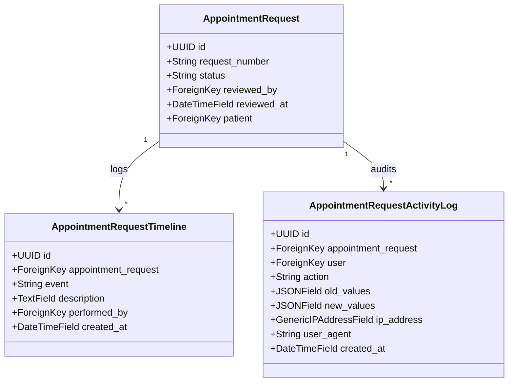

# Appointment Request Management API Gap Analysis & Documentation

This document evaluates the existing **Appointment Request Management** APIs of the Neuro Blooms Child Development Center EMR/HMS and identifies modifications, additions, and enhancements required to fully support the frontend "Appointment Request Details" page.

---

## Part 1: Gap Analysis

### 1. Existing APIs (Ready to Use)
These endpoints are fully implemented and require no modifications or enhancements for the page:
*   **Intake Statistics**: `GET /api/v1/appointment-requests/statistics/`
*   **Filter Metadata Options**: `GET /api/v1/appointment-requests/filter-options/`
*   **Export Submissions**: `POST /api/v1/appointment-requests/export/`
*   **PDF Summary Generation**: `GET /api/v1/appointment-requests/{id}/summary/` (Serves `can_print` action)
*   **Patient Database Search (Drawer)**: `GET /api/v1/patients/search/` (Used to populate the Link Patient drawer search results)
*   **Patient Matching Analysis**: `GET /api/v1/patient-matching/` (Finds match candidates automatically)
*   **Match Details Comparison**: `GET /api/v1/patient-matching/{patient_id}/details/` (Provides field-level comparison explanations)

### 2. Existing APIs requiring Enhancement
These endpoints require changes to their serializers, annotations, or service-layer response models:
*   **Appointment Request Details**: `GET /api/v1/appointment-requests/{id}/`
    *   *Missing fields*: Concatenated `child_name`, dynamically calculated `calculated_age`, nested `reviewed_by` object (rather than ID), detailed nested `patient` summary (when linked), and `action_metadata` block (including `can_approve`, `can_reject`, `can_create_patient`, `can_link_patient`, `can_convert`, `can_print`).
*   **Workflow Action Endpoints**:
    *   `POST /api/v1/appointment-requests/{id}/approve/`
    *   `POST /api/v1/appointment-requests/{id}/reject/`
    *   `POST /api/v1/appointment-requests/{id}/link-patient/`
    *   `POST /api/v1/appointment-requests/{id}/create-patient/`
    *   `POST /api/v1/appointment-requests/{id}/convert/`
    *   *Enhancement*: Ensure that upon success, these endpoints return the updated, fully-annotated `AppointmentRequestDetailSerializer` representation so that the frontend can refresh the entire UI state instantly without triggering an independent GET fetch.

### 3. Completely New APIs Required
These endpoints are missing in the existing codebase and must be introduced:
*   **Log View Session**: `POST /api/v1/appointment-requests/{id}/view/`
    *   *Purpose*: Logs when a staff member opens the request. Records the "Viewed" event in the request's timeline and audit trail.
*   **Timeline Registry**: `GET /api/v1/appointment-requests/{id}/timeline/`
    *   *Purpose*: Returns a paginated list of request-specific lifecycle events (Request Submitted, Viewed, Approved, Rejected, Patient Linked, Patient Created, Appointment Created) with performing actor details, timestamps, and custom descriptions.
*   **Activity Log/Audit Trail**: `GET /api/v1/appointment-requests/{id}/activity-log/`
    *   *Purpose*: Provides a paginated history of field-level changes (e.g. before/after snapshots of status, slot reschedule, patient links), tracking user, IP address, user-agent/browser details, and booking source.
*   **Conversion Status & Details**: `GET /api/v1/appointment-requests/{id}/conversion/`
    *   *Purpose*: Exposes details of the generated Appointment (Appointment number, doctor details, date, time slot, duration) for requests that have been converted.

---

## Part 2: Implementation Architecture

### 1. Database Model Additions
To implement robust timeline and audit logging without polluting generic or unrelated patient histories, we introduce two dedicated tables:



---

## Part 3: Enterprise API Reference

Below is the complete API documentation for all missing or enhanced endpoints.

---

### 1. [ENHANCED] Retrieve Appointment Request Details
*   **Method**: `GET`
*   **Endpoint**: `/api/v1/appointment-requests/{id}/`
*   **Authentication & Permissions**: `IsAuthenticated`, `IsAdminOrReceptionistOrDoctorReadOnly`

#### Purpose
Retrieves a detailed representation of a specific intake submission, enriched with computed fields, action flags, and nested records for patient matching, summary, and UI interactions.

#### Request Specification
*   **Path Parameters**:
    *   `id` (UUID, Required): Unique identifier of the appointment request.

#### Success Response
*   **Status Code**: `200 OK`
*   **Payload**:
```json
{
  "success": true,
  "message": "Appointment request retrieved.",
  "data": {
    "id": "e9a0665f-4632-4752-9ef4-8c858b8f2d5a",
    "request_number": "REQ-2026-00045",
    "status": "PATIENT_LINKED",
    "status_display": "Patient Linked",
    "booking_source": "WEBSITE",
    "created_at": "2026-07-02T10:15:30Z",
    "reviewed_by": {
      "id": "703a5e8f-e14b-4b10-8b1e-9a2d8e5b4c10",
      "full_name": "Sarah Connor",
      "email": "sarah.receptionist@neuroblooms.com"
    },
    "reviewed_at": "2026-07-02T11:00:00Z",
    "parent_information": {
      "parent_first_name": "John",
      "parent_last_name": "Doe",
      "relationship_to_child": "FATHER",
      "mobile_number": "9876543210",
      "alternate_mobile_number": "9876543211",
      "email": "john.doe@example.com"
    },
    "child_information": {
      "child_first_name": "Jane",
      "child_last_name": "Doe",
      "child_name": "Jane Doe",
      "date_of_birth": "2019-05-15",
      "calculated_age": "7 years, 1 month",
      "gender": "FEMALE"
    },
    "appointment_preference": {
      "appointment_type": "INITIAL",
      "appointment_type_display": "Initial Consultation",
      "preferred_date": "2026-07-20",
      "preferred_time_slot": "10:00 - 10:30",
      "referral_source": "DIRECT",
      "assigned_doctor": {
        "id": "d13a968f-f14c-4e10-9b1e-9a2d8e5b4c11",
        "full_name": "Dr. Alfred Adler",
        "email": "dr.adler@neuroblooms.com"
      }
    },
    "medical_information": {
      "primary_concern": "SPEECH_DELAY",
      "primary_concern_display": "Speech Delay",
      "additional_notes": "Child exhibits difficulty pronouncing soft consonants."
    },
    "linked_patient": {
      "id": "8a8b7c6d-5e4f-3a2b-1c0d-9e8f7a6b5c4d",
      "patient_code": "PAT-000014",
      "child_name": "Jane Doe",
      "parent_name": "John Doe",
      "mobile_number": "9876543210",
      "email": "john.doe@example.com",
      "patient_status": "ACTIVE"
    },
    "action_metadata": {
      "can_approve": true,
      "can_reject": true,
      "can_create_patient": false,
      "can_link_patient": false,
      "can_convert": true,
      "can_print": true
    }
  }
}
```

#### Performance Optimizations
*   **Query Optimization**: Use `select_related('patient', 'reviewed_by', 'patient_linked_by', 'patient_created_by')` and `prefetch_related('appointments', 'appointments__doctor')`.
*   **Database Annotations**:
    *   Pre-calculate age intervals at the database level to avoid Python-level date conversions where possible.
    *   Annotate `appointment_created_annotated` via `Exists()` to avoid N+1 queries.

---

### 2. [NEW] Log View Session
*   **Method**: `POST`
*   **Endpoint**: `/api/v1/appointment-requests/{id}/view/`
*   **Authentication & Permissions**: `IsAuthenticated`, `IsAdminOrReceptionistOrDoctorReadOnly`

#### Purpose
Logs an audit event when a staff member opens the request detail page. This records a "Viewed" event in the request's timeline.

#### Success Response
*   **Status Code**: `200 OK`
*   **Payload**:
```json
{
  "success": true,
  "message": "View event registered successfully."
}
```

#### Error Responses
*   **Status Code**: `404 Not Found` (If request ID does not exist).
```json
{
  "success": false,
  "message": "Appointment request not found."
}
```

#### Business Rules
*   **Idempotency & Throttling**: If the same user views the same request within a 5-minute window, suppress adding duplicate timeline entries.
*   **Audit Logging**: Inserts an entry into `AppointmentRequestTimeline` with event `Viewed` and `performed_by` as the authenticated user.

---

### 3. [NEW] Retrieve Timeline Registry
*   **Method**: `GET`
*   **Endpoint**: `/api/v1/appointment-requests/{id}/timeline/`
*   **Authentication & Permissions**: `IsAuthenticated`, `IsAdminOrReceptionistOrDoctorReadOnly`

#### Purpose
Retrieves a chronological record of events specifically tied to this intake submission, supporting pagination and descending/ascending orders.

#### Query Parameters
*   **Pagination**:
    *   `page` (Integer, Optional, Default: 1)
    *   `page_size` (Integer, Optional, Default: 10)
*   **Ordering**:
    *   `ordering` (String, Optional, Choices: `created_at`, `-created_at`, Default: `created_at`)

#### Success Response
*   **Status Code**: `200 OK`
*   **Payload**:
```json
{
  "success": true,
  "message": "Timeline events retrieved successfully.",
  "data": {
    "count": 3,
    "next": null,
    "previous": null,
    "results": [
      {
        "id": "3c0d8f7b-9e8a-4c4f-9a7c-6e8d5b4a3a10",
        "event": "Request Submitted",
        "description": "Appointment request REQ-2026-00045 was successfully submitted from Website.",
        "performed_by": null,
        "created_at": "2026-07-02T10:15:30Z"
      },
      {
        "id": "4c0d8f7b-9e8a-4c4f-9a7c-6e8d5b4a3a11",
        "event": "Viewed",
        "description": "Request was viewed by sarah.receptionist@neuroblooms.com",
        "performed_by": {
          "id": "703a5e8f-e14b-4b10-8b1e-9a2d8e5b4c10",
          "full_name": "Sarah Connor",
          "email": "sarah.receptionist@neuroblooms.com"
        },
        "created_at": "2026-07-02T10:45:00Z"
      },
      {
        "id": "5c0d8f7b-9e8a-4c4f-9a7c-6e8d5b4a3a12",
        "event": "Patient Linked",
        "description": "Linked to existing patient Jane Doe (PAT-000014)",
        "performed_by": {
          "id": "703a5e8f-e14b-4b10-8b1e-9a2d8e5b4c10",
          "full_name": "Sarah Connor",
          "email": "sarah.receptionist@neuroblooms.com"
        },
        "created_at": "2026-07-02T11:00:00Z"
      }
    ]
  }
}
```

---

### 4. [NEW] Retrieve Activity Log/Audit Trail
*   **Method**: `GET`
*   **Endpoint**: `/api/v1/appointment-requests/{id}/activity-log/`
*   **Authentication & Permissions**: `IsAuthenticated`, `IsAdminOrReceptionistOrDoctorReadOnly`

#### Purpose
Returns detailed system records of modifications made to the request data, highlighting change vectors (IP, Browser, Actor, Old/New Value Snapshots).

#### Query Parameters
*   **Pagination**:
    *   `page` (Integer, Optional, Default: 1)
    *   `page_size` (Integer, Optional, Default: 10)

#### Success Response
*   **Status Code**: `200 OK`
*   **Payload**:
```json
{
  "success": true,
  "message": "Activity log retrieved successfully.",
  "data": {
    "count": 1,
    "next": null,
    "previous": null,
    "results": [
      {
        "id": "0d8f7b9e-a8c4-4f9a-7c6e-8d5b4a3a1012",
        "actor": {
          "id": "703a5e8f-e14b-4b10-8b1e-9a2d8e5b4c10",
          "full_name": "Sarah Connor",
          "email": "sarah.receptionist@neuroblooms.com"
        },
        "action": "RESCHEDULED",
        "old_values": {
          "preferred_date": "2026-07-15",
          "preferred_time_slot": "09:00 - 09:30"
        },
        "new_values": {
          "preferred_date": "2026-07-20",
          "preferred_time_slot": "10:00 - 10:30"
        },
        "ip_address": "192.168.1.55",
        "browser": "Chrome 126.0.0.0 (Windows 11)",
        "booking_source": "RECEPTIONIST",
        "created_at": "2026-07-02T10:55:00Z"
      }
    ]
  }
}
```

---

### 5. [NEW] Retrieve Conversion Status & Details
*   **Method**: `GET`
*   **Endpoint**: `/api/v1/appointment-requests/{id}/conversion/`
*   **Authentication & Permissions**: `IsAuthenticated`, `IsAdminOrReceptionistOrDoctorReadOnly`

#### Purpose
Provides detailed information about the resulting Appointment if the request has been converted.

#### Success Response
*   **Status Code**: `200 OK`
*   **Payload**:
```json
{
  "success": true,
  "message": "Conversion details retrieved.",
  "data": {
    "is_converted": true,
    "appointment": {
      "id": "c7a8b9c0-d1e2-3f4a-5b6c-7d8e9f0a1b2c",
      "appointment_number": "APT-20260720-FF88E2",
      "status": "CONFIRMED",
      "appointment_date": "2026-07-20",
      "start_time": "10:00:00",
      "end_time": "10:30:00",
      "duration_minutes": 30,
      "doctor": {
        "id": "d13a968f-f14c-4e10-9b1e-9a2d8e5b4c11",
        "full_name": "Dr. Alfred Adler",
        "email": "dr.adler@neuroblooms.com"
      }
    }
  }
}
```

#### Secondary Success Response (Not Converted)
*   **Status Code**: `200 OK`
*   **Payload**:
```json
{
  "success": true,
  "message": "This request has not yet been converted into an appointment.",
  "data": {
    "is_converted": false,
    "appointment": null
  }
}
```

---

## Part 4: Standardized Error Schema Reference

All endpoints in the consultations module return a standardized error format when validation or business rules fail. Below are the mappings for HTTP error codes.

### 400 Bad Request
Occurs when serialization validation fails (e.g. invalid date formats, missing fields).
```json
{
  "success": false,
  "message": "Validation failed.",
  "errors": {
    "date_of_birth": [
      "Date of birth cannot be in the future."
    ]
  }
}
```

### 401 Unauthorized
Occurs when no authorization credentials (JWT Token) are provided or are invalid.
```json
{
  "success": false,
  "message": "Authentication credentials were not provided."
}
```

### 403 Forbidden
Occurs when the authenticated user does not have receptionist, admin, or doctor role permissions.
```json
{
  "success": false,
  "message": "You do not have permission to perform this action."
}
```

### 404 Not Found
Occurs when the request ID or linked resources do not exist.
```json
{
  "success": false,
  "message": "Appointment request not found."
}
```

### 409 Conflict
Occurs when an action conflicts with system constraints (e.g. double-approving or double-converting).
```json
{
  "success": false,
  "message": "Appointment request is already approved."
}
```

### 422 Unprocessable Entity
Occurs when business rules fail (e.g. doctor leaves, clinic holidays, or exceeding max capacity).
```json
{
  "success": false,
  "message": "Selected slot overlaps with doctor's blocked slot."
}
```

### 500 Internal Server Error
Occurs when database queries fail or general exceptions occur.
```json
{
  "success": false,
  "message": "An unexpected error occurred while processing your request.",
  "errors": {
    "non_field_errors": [
      "Database connection timed out."
    ]
  }
}
```
