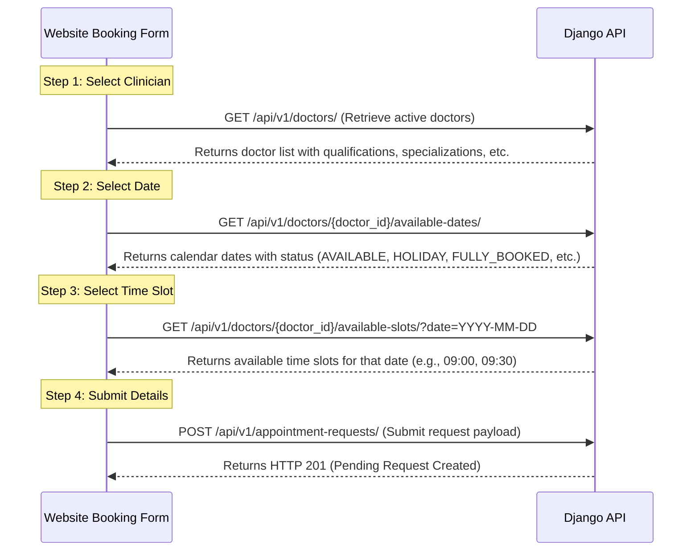

# Public Booking Flow API Documentation

This document describes the public booking APIs used in the **Neuro Blooms** booking flow. It provides frontend developers with the necessary endpoints, payloads, validation rules, and error handling behaviors to integrate these APIs into the website booking widget.

---

## Overview of the Booking Flow


---

## 1. Doctor Dropdown

### Purpose
Retrieves a list of all active doctors/clinicians who are configured in the system. Used to populate the doctor dropdown or selection cards at the beginning of the booking flow.

* **Method:** `GET`
* **Endpoint:** `/api/v1/doctors/`
* **Authentication:** None (Public Endpoint)
* **Frontend Integration:** Integrate at the start of the booking form to let the user select a clinician.

### Model Schema
This endpoint serializes the `User` model filtered by the `DOCTOR` role and `is_active=True`. It also checks the `DoctorAvailability` model to see if they are accepting appointments.

| Field Name | Type | Description |
| :--- | :--- | :--- |
| `id` | `UUID` | Unique identifier for the doctor. |
| `full_name` | `String` | Combined `first_name` and `last_name`. |
| `profile_image` | `String` (URL) | Absolute URL to the doctor's profile picture (or `null`). |
| `qualification` | `String` | Academic/professional qualifications (e.g., "M.Sc. Clinical Psychology"). |
| `specialization` | `String` | Area of expertise (e.g., "Autism & Developmental Disorders"). |
| `experience` | `Integer` | Years of experience. |
| `accepts_appointments` | `Boolean` | Indicates whether the doctor is currently accepting bookings. |

### Success Response
* **Status Code:** `200 OK`
* **Response Body:**
```json
{
  "success": true,
  "message": "Doctors retrieved successfully.",
  "data": [
    {
      "id": "7bf26f02-a4e9-4e5b-b9f1-d07f3531b268",
      "full_name": "Dr. Sarah Johnson",
      "profile_image": "https://api.neuroblooms.com/media/profile_images/dr_sarah.jpg",
      "qualification": "Ph.D. in Child Psychology",
      "specialization": "Pediatric Neurodevelopment",
      "experience": 12,
      "accepts_appointments": true
    }
  ]
}
```

### Error Responses
* **Status Code:** `500 Internal Server Error`
* **Response Body:**
```json
{
  "success": false,
  "message": "An unexpected error occurred while retrieving doctors."
}
```

---

## 2. Available Dates Calendar

### Purpose
Calculates and returns the availability status for every date in the clinic's booking window (e.g., next 30 days) for a specific doctor. Used to populate and style the date picker calendar (e.g., highlighting available dates vs. graying out holidays, leaves, or fully booked days).

* **Method:** `GET`
* **Endpoint:** `/api/v1/doctors/{doctor_id}/available-dates/`
* **Authentication:** None (Public Endpoint)
* **Frontend Integration:** Triggered immediately after a user selects a doctor. Used to render the date picker.

### Request Parameters
* **Path Parameters:**
  * `doctor_id` (UUID, Required) - The ID of the selected doctor.

### Business Logic & Rules
The backend evaluates each date starting from today (or tomorrow if same-day booking is disabled in `ClinicSettings`) up to the configured `booking_window_days`. It determines availability by checking:
1. **Clinic Settings:** Is same-day booking allowed? What is the booking window?
2. **Clinic Weekly Schedule:** Is the clinic open on this day of the week?
3. **Clinic Holidays:** Is this date a registered holiday?
4. **Doctor Leave:** Is the doctor on leave during this date?
5. **Doctor Working Days:** Is the doctor scheduled to work on this weekday?
6. **Max Patient Limit:** Has the doctor already reached their maximum daily patient limit?
7. **Slot Availability:** Does the doctor have at least one free, unbooked, and unblocked slot on this day?

### Success Response
* **Status Code:** `200 OK`
* **Response Body:**
```json
{
  "success": true,
  "message": "Available dates retrieved successfully.",
  "data": [
    {
      "date": "2026-06-29",
      "weekday": "MONDAY",
      "status": "AVAILABLE",
      "message": "Available"
    },
    {
      "date": "2026-06-30",
      "weekday": "TUESDAY",
      "status": "FULLY_BOOKED",
      "message": "No slots available"
    },
    {
      "date": "2026-07-04",
      "weekday": "SATURDAY",
      "status": "DOCTOR_OFF",
      "message": "Doctor off duty"
    },
    {
      "date": "2026-07-05",
      "weekday": "SUNDAY",
      "status": "CLINIC_CLOSED",
      "message": "Clinic closed"
    },
    {
      "date": "2026-07-10",
      "weekday": "FRIDAY",
      "status": "ON_LEAVE",
      "message": "Doctor on leave"
    },
    {
      "date": "2026-07-15",
      "weekday": "WEDNESDAY",
      "status": "HOLIDAY",
      "message": "Clinic holiday"
    }
  ]
}
```

#### Possible Status Values:
* `AVAILABLE`: Date is open for booking.
* `NOT_ACCEPTING_APPOINTMENTS`: Doctor has turned off bookings.
* `CLINIC_CLOSED`: Clinic is closed on this day of the week.
* `HOLIDAY`: Registered clinic holiday.
* `ON_LEAVE`: Doctor is on leave.
* `DOCTOR_OFF`: Doctor does not work on this weekday.
* `FULLY_BOOKED`: Doctor's daily patient limit has been reached, or all slots are taken.

### Error Responses
* **Status Code:** `404 Not Found` (Doctor not found)
```json
{
  "success": false,
  "message": "Doctor not found."
}
```
* **Status Code:** `400 Bad Request` (Invalid UUID format)
```json
{
  "success": false,
  "message": "[\"“invalid-uuid” is not a valid UUID.\"]"
}
```
* **Status Code:** `500 Internal Server Error` (Missing clinic configuration or system error)
```json
{
  "success": false,
  "message": "Clinic configuration missing."
}
```

---

## 3. Available Slots for Selected Date

### Purpose
Retrieves all available time slots for a specific doctor on a selected date. Used to populate the time slot selector on the frontend after a user selects an available date from the calendar.

* **Method:** `GET`
* **Endpoint:** `/api/v1/doctors/{doctor_id}/available-slots/`
* **Query Parameters:**
  * `date` (String in `YYYY-MM-DD` format, Required)
* **Authentication:** None (Public Endpoint)
* **Frontend Integration:** Triggered when the user clicks on a date in the calendar.

### Business Logic & Rules
1. Generates raw time slots between the doctor's start and end times (bounded by the clinic's operating hours) using the doctor's `consultation_duration_minutes` (fallback to clinic `slot_duration_minutes`).
2. If the requested date is **today**, it filters out any slots that start within the next **10 minutes** from the current time.
3. Removes slots that overlap with:
   * **Clinic Breaks** (e.g., Lunch breaks).
   * **Doctor Blocked Slots** (e.g., Meetings, administrative time).
   * **Existing Appointments** with a status of `PENDING`, `CONFIRMED`, `CHECKED_IN`, or `IN_CONSULTATION`.

### Success Response
* **Status Code:** `200 OK`
* **Response Body:**
```json
{
  "success": true,
  "message": "Available slots retrieved successfully.",
  "data": [
    {
      "start_time": "09:00",
      "end_time": "09:30",
      "display": "9:00 AM - 9:30 AM"
    },
    {
      "start_time": "09:30",
      "end_time": "10:00",
      "display": "9:30 AM - 10:00 AM"
    },
    {
      "start_time": "10:30",
      "end_time": "11:00",
      "display": "10:30 AM - 11:00 AM"
    }
  ]
}
```

### Error Responses
* **Status Code:** `400 Bad Request` (Missing Date)
```json
{
  "success": false,
  "message": "Date parameter is required."
}
```
* **Status Code:** `400 Bad Request` (Invalid Date Format)
```json
{
  "success": false,
  "message": "Invalid date format. Use YYYY-MM-DD."
}
```
* **Status Code:** `400 Bad Request` (Date Outside Booking Window)
```json
{
  "success": false,
  "message": "Requested date is outside the booking window."
}
```
* **Status Code:** `404 Not Found` (Doctor not found)
```json
{
  "success": false,
  "message": "Doctor not found."
}
```

---

## 4. Submit Appointment Request

### Purpose
Submits a new appointment request from the public website booking form. This creates a pending request which the administrative staff can review and approve/reject.

* **Method:** `POST`
* **Endpoint:** `/api/v1/appointment-requests/`
* **Authentication:** None (Public Endpoint)
* **Content-Type:** `application/json`
* **Frontend Integration:** Triggered when the user submits the final step of the booking form.

### Request Payload (JSON)
```json
{
  "doctor_id": "7bf26f02-a4e9-4e5b-b9f1-d07f3531b268",
  "parent_first_name": "Jane",
  "parent_last_name": "Doe",
  "relationship_to_child": "MOTHER",
  "mobile_number": "9876543210",
  "alternate_mobile_number": "9876543211",
  "email": "jane.doe@example.com",
  "child_first_name": "Jimmy",
  "child_last_name": "Doe",
  "date_of_birth": "2020-05-15",
  "gender": "MALE",
  "appointment_type": "INITIAL_CONSULTATION",
  "primary_concern": "Speech delay concerns and limited eye contact.",
  "preferred_date": "2026-07-02",
  "preferred_time_slot": "10:30",
  "additional_notes": "Prefers morning slots if possible.",
  "referral_source": "Google Search"
}
```

### Payload Fields & Constraints

| Field | Type | Required? | Constraints / Allowed Values |
| :--- | :--- | :---: | :--- |
| `doctor_id` | `UUID` | Yes | Must be a valid active doctor ID. |
| `parent_first_name` | `String` | Yes | Max 150 characters. |
| `parent_last_name` | `String` | Yes | Max 150 characters. |
| `relationship_to_child` | `String` | Yes | Choice: `FATHER`, `MOTHER`, `GUARDIAN`, `GRANDPARENT`, `OTHER` |
| `mobile_number` | `String` | Yes | Max 20 characters. |
| `alternate_mobile_number`| `String` | No | Max 20 characters. Can be `null` or empty. |
| `email` | `String` | Yes | Must be a valid email address format. |
| `child_first_name` | `String` | Yes | Max 150 characters. |
| `child_last_name` | `String` | Yes | Max 150 characters. |
| `date_of_birth` | `String` (Date)| Yes | Format: `YYYY-MM-DD`. Cannot be in the future. |
| `gender` | `String` | Yes | Choice: `MALE`, `FEMALE`, `OTHER`, `PREFER_NOT_TO_SAY` |
| `appointment_type` | `String` | Yes | Choice: `INITIAL`, `FOLLOW_UP`, `REVIEW`, `INITIAL_CONSULTATION`, `DEVELOPMENT_ASSESSMENT` |
| `primary_concern` | `String` | Yes | Text area / long text. |
| `preferred_date` | `String` (Date)| Yes | Format: `YYYY-MM-DD`. Cannot be in the past. Must be in booking window. |
| `preferred_time_slot` | `String` (Time)| Yes | Format: `HH:MM` (24-hour format matching start_time of an available slot). |
| `additional_notes` | `String` | No | Can be `null` or empty. |
| `referral_source` | `String` | No | Max 255 characters. Can be `null` or empty. |

### Backend Processing & Validations
When a request is submitted, the backend performs the following steps:
1. **Child Age Validation:** Validates that `date_of_birth` is not in the future.
2. **Date Validation:** Validates that `preferred_date` is not in the past.
3. **Availability Validation:** Re-runs the slot generation logic to ensure that the chosen `preferred_time_slot` is still available and has not been booked or blocked in the interim.
4. **Duplicate Booking Prevention:** Rejects the request if a booking with the same `mobile_number`, `preferred_date`, and `preferred_time_slot` already exists (as either a pending/approved request or a confirmed appointment).
5. **Auto-Generated Fields:**
   * Generates a unique `request_number` in the format: `REQ-YYYYMMDD-[4-digit-hex]` (e.g., `REQ-20260629-A4B2`).
   * Automatically sets `status` to `PENDING` and `booking_source` to `WEBSITE`.
   * Automatically prepends `[Preferred Doctor: <Doctor Name>]` to the `additional_notes` field.
6. **Email Confirmation:** Asynchronously triggers an email to the parent confirming receipt of the request.

### Success Response
* **Status Code:** `201 Created`
* **Response Body:**
```json
{
  "success": true,
  "message": "Appointment request submitted successfully.",
  "data": {
    "id": 42,
    "request_number": "REQ-20260629-FA8C",
    "status": "PENDING",
    "child_first_name": "Jimmy",
    "child_last_name": "Doe",
    "preferred_date": "2026-07-02",
    "preferred_time_slot": "10:30"
  }
}
```

### Error Responses

#### 1. Validation Failures (HTTP 400 Bad Request)
Standard validation errors return a dictionary under the `"errors"` key.

* **Field-level validation error (e.g., Child's DOB in the future):**
```json
{
  "success": false,
  "message": "Validation failed.",
  "errors": {
    "date_of_birth": [
      "Child's date of birth cannot be in the future."
    ]
  }
}
```

* **Preferred Date in the past:**
```json
{
  "success": false,
  "message": "Validation failed.",
  "errors": {
    "preferred_date": [
      "Preferred appointment date cannot be in the past."
    ]
  }
}
```

* **Preferred Date outside booking window:**
```json
{
  "success": false,
  "message": "Validation failed.",
  "errors": {
    "preferred_date": [
      "Requested date is outside the booking window."
    ]
  }
}
```

* **Doctor Unavailable on the selected date (Holiday, Leave, Off Duty, or Daily Limit Reached):**
```json
{
  "success": false,
  "message": "Validation failed.",
  "errors": {
    "preferred_date": [
      "Clinic Holiday"
    ]
  }
}
```
*(Other possible messages: `"Clinic closed"`, `"Doctor is not accepting appointments"`, `"Doctor off duty"`, `"Doctor on leave"`, `"Doctor daily patient limit reached"`)*

* **Selected Time Slot no longer available:**
```json
{
  "success": false,
  "message": "Validation failed.",
  "errors": {
    "preferred_time_slot": [
      "Selected slot is no longer available. Reason: Slot already booked or unavailable."
    ]
  }
}
```

* **Duplicate Booking Found:**
```json
{
  "success": false,
  "message": "Validation failed.",
  "errors": {
    "non_field_errors": [
      "Duplicate booking exists."
    ]
  }
}
```

* **Missing / Invalid Fields:**
```json
{
  "success": false,
  "message": "Validation failed.",
  "errors": {
    "parent_first_name": [
      "This field is required."
    ],
    "email": [
      "Enter a valid email address."
    ],
    "relationship_to_child": [
      "\"MOTHERR\" is not a valid choice."
    ]
  }
}
```

#### 2. System Errors (HTTP 500 Internal Server Error)
* **Unexpected system failure:**
```json
{
  "success": false,
  "message": "An unexpected error occurred while submitting the request."
}
```
