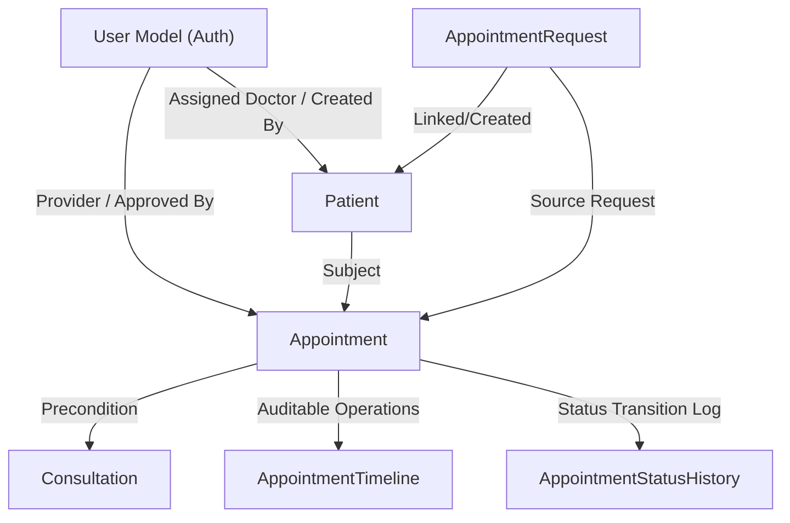

# Consultation Module Database Schema Reference

This document serves as the official reference for the database schema of the **Consultation & Scheduling** module in the Neuro Blooms backend.

---

## 1. Module Overview

The `consultations` application is the core scheduling and clinical care engine of the Neuro Blooms Child Development Center. It manages:
- **Scheduling Configurations**: Global clinic settings, holiday calendars, weekly opening schedules, and clinic breaks.
- **Provider Availability**: Doctor working days, block schedules, leaves, and overall preferences.
- **Client & Patient Intake**: Pre-assessment requests, child patient profiles, and medical alert registries.
- **Appointment Management**: Active booking instances, slot generators, timeline event tracking, notes, and attachment handling.
- **Clinical Records**: Post-visit consultations containing summaries, clinical observations, recommendations, and follow-ups.

### Module Interactions


---

## 2. Consultation & Scheduling Workflow

The typical lifecycle of a consultation request and scheduling flow spans from public intake to follow-up:

```
Public/Admin Appointment Request (PENDING)
   │
   ├─► Rejected (REJECTED) [Reason recorded, stops here]
   │
   └─► Approved (APPROVED)
         │
         ▼
     Create or Link Patient Profile (PATIENT_CREATED / PATIENT_LINKED)
         │
         ▼
     Book & Confirm Appointment (CONFIRMED) [Associates with Doctor & Available Slot]
         │
         ▼
     Checked In (CHECKED_IN) [Patient arrives at center]
         │
         ▼
     In Session (IN_CONSULTATION)
         │
         ▼
     Completed Consultation (COMPLETED) [Doctor files Consultation record]
         │
         ├─► Follow-up Required ──► Book Next Appointment (child_appointments)
         │
         └─► Treatment Complete / Discharged (DISCHARGED)
```

---

## 3. Database Models Summary

| Model Class | Purpose / Description | Table Name | Soft Delete | Unique/Special Constraints |
| :--- | :--- | :--- | :---: | :--- |
| **BaseModel** | Abstract parent model containing UUID primary key, timestamps, and active flag. | *N/A (Abstract)* | No | None |
| **Patient** | Patient profiles representing children receiving care. | `consultations_patients` | Yes | `patient_number` (Unique) |
| **AppointmentRequest** | Public or admin-created appointment intake requests. | `consultations_appointment_requests` | No | `request_number` (Unique) |
| **Appointment** | Confirmed session bookings mapping a patient to a doctor and time slot. | `consultations_appointments` | No | `appointment_number` (Unique), check constraints on timings |
| **Consultation** | Medical evaluation records filled by doctors post-appointment. | `consultations_consultations` | No | `appointment` (One-to-One) |
| **AppointmentSlot** | Individual generated calendar slots for appointments. | `consultations_appointment_slots` | No | `(doctor, slot_date, start_time, end_time)` (Unique) |
| **AppointmentSettings** | Global scheduling parameters. | `consultations_appointment_settings` | No | None |
| **DoctorAvailability** | Doctor preferences (default durations, patient limits). | `consultations_doctor_availabilities` | No | `(doctor, is_active=True)` (Unique) |
| **AppointmentStatusHistory** | Auditing record of status changes for an appointment. | `consultations_appointment_status_history` | No | None |
| **AppointmentNote** | Threaded comments/notes on specific appointments with visibility settings. | `consultations_appointment_notes` | No | None |
| **AppointmentAttachment** | File uploads (reports, certificates) associated with appointments. | `consultations_appointment_attachments` | No | None |
| **ClinicHoliday** | Calendar dates when the clinic is completely closed. | `consultations_clinic_holidays` | No | `holiday_date` (Unique) |
| **DoctorLeave** | Dates when specific doctors are out of office. | `consultations_doctor_leaves` | No | Check constraint: `end_date >= start_date` |
| **ClinicSettings** | Clinic name, operating hours, and booking window settings. | `consultations_clinic_settings` | No | `(is_active=True)` (Unique), check constraints on durations and hours |
| **ClinicWeeklySchedule** | Days of the week the clinic is open and standard opening/closing hours. | `consultations_clinic_weekly_schedules` | No | `weekday` (Unique), check constraint on hours |
| **ClinicBreak** | Daily break times (e.g. lunch hour) when appointments cannot be booked. | `consultations_clinic_breaks` | No | Check constraint: `end_time > start_time` |
| **DoctorWorkingDay** | Defined schedule of working days and times for each provider. | `consultations_doctor_working_days` | No | `(doctor, weekday)` (Unique), check constraint on hours |
| **DoctorBlockedSlot** | Specific times when a doctor is blocked from receiving appointments. | `consultations_doctor_blocked_slots` | No | Check constraint: `end_time > start_time` |
| **AppointmentTimeline** | Granular lifecycle audit logs for appointment actions. | `consultations_appointment_timelines` | No | None |

---

## 4. Fields Specification

### 4.1. BaseModel (Abstract)
- **`id`**
  - Type: `UUIDField`
  - Nullable: No (Primary Key)
  - Default: `uuid.uuid4`
  - Description: Unique identifier.
- **`created_at`**
  - Type: `DateTimeField`
  - Nullable: No (Auto-set)
  - Default: Current Timestamp
- **`updated_at`**
  - Type: `DateTimeField`
  - Nullable: No (Auto-update)
  - Default: Current Timestamp
- **`is_active`**
  - Type: `BooleanField`
  - Nullable: No
  - Default: `True`

### 4.2. Patient
- **`patient_number`**: `CharField(max_length=50)`, Required, Unique. Example: `PAT-2026-0001`
- **`parent_first_name`**: `CharField(max_length=150)`, Required.
- **`parent_last_name`**: `CharField(max_length=150)`, Required.
- **`relationship_to_child`**: `CharField(max_length=50)`, Choices: `RelationshipToChild` enums, Required.
- **`mobile_number`**: `CharField(max_length=20)`, Required.
- **`alternate_mobile_number`**: `CharField(max_length=20)`, Optional.
- **`email`**: `EmailField`, Required.
- **`child_first_name`**: `CharField(max_length=150)`, Required.
- **`child_last_name`**: `CharField(max_length=150)`, Required.
- **`date_of_birth`**: `DateField`, Required. Must be in the past.
- **`gender`**: `CharField(max_length=20)`, Choices: `Gender` enums, Required.
- **`address`**: `TextField`, Required.
- **`patient_status`**: `CharField(max_length=30)`, Choices: `PatientStatus` enums, Default: `ACTIVE`.
- **`assigned_doctor`**: `ForeignKey(User)`, Optional, Set Null. References the primary doctor.
- **`emergency_contact_name`**: `CharField(max_length=150)`, Optional.
- **`emergency_contact_phone`**: `CharField(max_length=20)`, Optional.
- **`preferred_language`**: `CharField(max_length=50)`, Optional.
- **`referral_source`**: `CharField(max_length=255)`, Optional.
- **`primary_diagnosis`**: `TextField`, Optional.
- **`notes`**: `TextField`, Optional. Medical history details.
- **`photo`**: `ImageField(upload_to="patients/")`, Optional.
- **`blood_group`**: `CharField(max_length=10)`, Optional.
- **`allergies`**: `TextField`, Optional.
- **`medical_alerts`**: `TextField`, Optional. Critical medical conditions.
- **`current_focus`**: `TextField`, Optional. Focus areas for development.
- **`therapy_started`**: `DateField`, Optional.
- **`treatment_summary`**: `TextField`, Optional.
- **`current_progress`**: `TextField`, Optional.
- **`latest_recommendation`**: `TextField`, Optional.
- **`current_treatment_plan`**: `TextField`, Optional.
- **`internal_notes`**: `TextField`, Optional. Hidden from parents.
- **`recommended_sessions`**: `IntegerField`, Default: `10`.
- **`is_deleted`**: `BooleanField`, Default: `False`. Used for soft deleting records.
- **`deleted_at`**: `DateTimeField`, Optional.
- **`deleted_by`**: `ForeignKey(User)`, Optional, Set Null.
- **`created_by`**: `ForeignKey(User)`, Optional, Set Null.

### 4.3. AppointmentRequest
- **`request_number`**: `CharField(max_length=50)`, Required, Unique. Example: `REQ-2026-0099`
- **`parent_first_name`**: `CharField(max_length=150)`, Required.
- **`parent_last_name`**: `CharField(max_length=150)`, Required.
- **`relationship_to_child`**: `CharField(max_length=50)`, Choices: `RelationshipToChild` enums, Required.
- **`mobile_number`**: `CharField(max_length=20)`, Required.
- **`alternate_mobile_number`**: `CharField(max_length=20)`, Optional.
- **`email`**: `EmailField`, Required.
- **`child_first_name`**: `CharField(max_length=150)`, Required.
- **`child_last_name`**: `CharField(max_length=150)`, Required.
- **`date_of_birth`**: `DateField`, Required.
- **`gender`**: `CharField(max_length=20)`, Choices: `Gender` enums, Required.
- **`appointment_type`**: `CharField(max_length=50)`, Choices: `AppointmentType` enums, Required.
- **`primary_concern`**: `TextField`, Required. Primary developmental concern.
- **`preferred_date`**: `DateField`, Required.
- **`preferred_time_slot`**: `CharField(max_length=50)`, Required. E.g. "Morning", "Afternoon".
- **`additional_notes`**: `TextField`, Optional.
- **`referral_source`**: `CharField(max_length=255)`, Optional.
- **`booking_source`**: `CharField(max_length=20)`, Choices: `BookingSource` enums, Default: `WEBSITE`.
- **`status`**: `CharField(max_length=20)`, Choices: `AppointmentRequestStatus` enums, Default: `PENDING`.
- **`rejection_reason`**: `TextField`, Optional. Reason why the request was declined.
- **`reviewed_by`**: `ForeignKey(User)`, Optional, Set Null. Reviewing Administrator.
- **`reviewed_at`**: `DateTimeField`, Optional.
- **`patient`**: `ForeignKey(Patient)`, Optional, Set Null. The profile linked/created during approval.
- **`patient_linked_by`**: `ForeignKey(User)`, Optional, Set Null.
- **`patient_linked_at`**: `DateTimeField`, Optional.
- **`patient_created_by`**: `ForeignKey(User)`, Optional, Set Null.
- **`patient_created_at`**: `DateTimeField`, Optional.

### 4.4. Appointment
- **`appointment_number`**: `CharField(max_length=50)`, Required, Unique. Example: `APT-10023`
- **`patient`**: `ForeignKey(Patient)`, Required, Protect. Subject child.
- **`doctor`**: `ForeignKey(User)`, Optional, Protect. Assigned clinician.
- **`appointment_request`**: `ForeignKey(AppointmentRequest)`, Optional, Set Null. Intake source.
- **`appointment_type`**: `CharField(max_length=50)`, Choices: `AppointmentType` enums, Required.
- **`parent_appointment`**: `ForeignKey(self)`, Optional, Set Null. Recursive relation for linked series.
- **`booking_source`**: `CharField(max_length=20)`, Choices: `BookingSource` enums, Required.
- **`status`**: `CharField(max_length=20)`, Choices: `AppointmentStatus` enums, Default: `CONFIRMED`.
- **`appointment_date`**: `DateField`, Required.
- **`start_time`**: `TimeField`, Required.
- **`end_time`**: `TimeField`, Required.
- **`duration_minutes`**: `PositiveIntegerField`, Default: `30`.
- **`priority`**: `CharField(max_length=20)`, Choices: `Priority` enums, Default: `MEDIUM`.
- **`referral_source`**: `CharField(max_length=50)`, Choices: `ReferralSource` enums, Optional.
- **`visit_reason`**: `TextField`, Default: "", Optional.
- **`internal_notes`**: `TextField`, Optional. Clinician/receptionist notes.
- **`approved_by`**: `ForeignKey(User)`, Required, Protect. Approving admin user.
- **`created_by`**: `ForeignKey(User)`, Required, Protect.
- **`updated_by`**: `ForeignKey(User)`, Optional, Set Null.

### 4.5. Consultation
- **`appointment`**: `OneToOneField(Appointment)`, Required, Protect. Links to a single appointment.
- **`doctor`**: `ForeignKey(User)`, Required, Protect. The clinician authoring the notes.
- **`consultation_summary`**: `TextField`, Required. High-level visit review.
- **`clinical_observation`**: `TextField`, Required. Specific behavioral or medical observations.
- **`doctor_recommendations`**: `TextField`, Required. Action items or therapeutic guidance.
- **`next_review_date`**: `DateField`, Optional. Recommended date for next checkup.
- **`followup_required`**: `BooleanField`, Default: `False`.

### 4.6. AppointmentSlot
- **`doctor`**: `ForeignKey(User)`, Required, Protect. Doctor the slot belongs to.
- **`slot_date`**: `DateField`, Required.
- **`start_time`**: `TimeField`, Required.
- **`end_time`**: `TimeField`, Required.
- **`status`**: `CharField(max_length=20)`, Choices: `SlotStatus` enums, Default: `AVAILABLE`.
- **`appointment`**: `ForeignKey(Appointment)`, Optional, Set Null. Booking associated with this slot.

### 4.7. AppointmentSettings
- **`slot_duration`**: `PositiveIntegerField`, Default: `30`. Default duration for generated slots.
- **`clinic_start_time`**: `TimeField`, Required. Start of scheduling operations.
- **`clinic_end_time`**: `TimeField`, Required. End of scheduling operations.
- **`max_bookings_per_slot`**: `PositiveIntegerField`, Default: `1`.
- **`buffer_minutes`**: `PositiveIntegerField`, Default: `5`. Rest time between slots.

### 4.8. DoctorAvailability
- **`doctor`**: `ForeignKey(User)`, Required, Cascade. Doctor to whom these preferences belong.
- **`consultation_duration_minutes`**: `PositiveIntegerField`, Default: `30`.
- **`max_daily_patients`**: `PositiveIntegerField`, Default: `15`. Daily scheduling safety limit.
- **`accepts_appointments`**: `BooleanField`, Default: `True`. Flag to halt scheduling for a provider.

### 4.9. AppointmentStatusHistory
- **`appointment`**: `ForeignKey(Appointment)`, Required, Cascade.
- **`previous_status`**: `CharField(max_length=20)`, Choices: `AppointmentStatus` enums, Optional.
- **`new_status`**: `CharField(max_length=20)`, Choices: `AppointmentStatus` enums, Required.
- **`changed_by`**: `ForeignKey(User)`, Required, Protect.
- **`reason`**: `TextField`, Optional. Reason for the change (e.g. cancellation notes).

### 4.10. AppointmentNote
- **`appointment`**: `ForeignKey(Appointment)`, Required, Cascade.
- **`user`**: `ForeignKey(User)`, Required, Protect. Author of the comment.
- **`note`**: `TextField`, Required. Comment text.
- **`visibility`**: `CharField(max_length=20)`, Choices: `NoteVisibility` enums, Default: `PRIVATE`.

### 4.11. AppointmentAttachment
- **`appointment`**: `ForeignKey(Appointment)`, Required, Cascade.
- **`uploaded_by`**: `ForeignKey(User)`, Required, Protect.
- **`file`**: `FileField(upload_to="appointment_attachments/")`, Required.
- **`description`**: `TextField`, Optional.

### 4.12. ClinicHoliday
- **`title`**: `CharField(max_length=255)`, Default: "", Optional.
- **`holiday_date`**: `DateField`, Required, Unique. Date of clinic closure.
- **`description`**: `TextField`, Optional.

### 4.13. DoctorLeave
- **`doctor`**: `ForeignKey(User)`, Required, Cascade. Leave taker.
- **`start_date`**: `DateField`, Required.
- **`end_date`**: `DateField`, Required.
- **`reason`**: `TextField`, Optional.
- **`approved_by`**: `ForeignKey(User)`, Optional, Set Null. Approving administrator.

### 4.14. ClinicSettings (Singleton Configuration)
- **`clinic_name`**: `CharField(max_length=255)`, Required.
- **`opening_time`**: `TimeField`, Required.
- **`closing_time`**: `TimeField`, Required.
- **`slot_duration_minutes`**: `PositiveIntegerField`, Default: `30`.
- **`booking_window_days`**: `PositiveIntegerField`, Default: `30`. How far in advance bookings are allowed.
- **`allow_same_day_booking`**: `BooleanField`, Default: `True`.
- **`max_daily_appointments`**: `PositiveIntegerField`, Default: `50`. Limit across all patients and doctors.
- **`timezone`**: `CharField(max_length=100)`, Default: `"UTC"`. Timezone for processing slot boundaries.

### 4.15. ClinicWeeklySchedule
- **`weekday`**: `CharField(max_length=20)`, Choices: `Weekday` enums, Required, Unique.
- **`is_open`**: `BooleanField`, Default: `True`.
- **`opening_time`**: `TimeField`, Optional. Required if `is_open` is `True`.
- **`closing_time`**: `TimeField`, Optional. Required if `is_open` is `True`.

### 4.16. ClinicBreak
- **`weekday`**: `CharField(max_length=20)`, Choices: `Weekday` enums, Required.
- **`title`**: `CharField(max_length=255)`, Required (e.g. "Lunch Break").
- **`start_time`**: `TimeField`, Required.
- **`end_time`**: `TimeField`, Required.

### 4.17. DoctorWorkingDay
- **`doctor`**: `ForeignKey(User)`, Required, Cascade.
- **`weekday`**: `CharField(max_length=20)`, Choices: `Weekday` enums, Required.
- **`is_working`**: `BooleanField`, Default: `True`.
- **`start_time`**: `TimeField`, Optional. Required if `is_working` is `True`.
- **`end_time`**: `TimeField`, Optional. Required if `is_working` is `True`.

### 4.18. DoctorBlockedSlot
- **`doctor`**: `ForeignKey(User)`, Required, Cascade.
- **`block_date`**: `DateField`, Required.
- **`start_time`**: `TimeField`, Required.
- **`end_time`**: `TimeField`, Required.
- **`reason`**: `TextField`, Optional.
- **`created_by`**: `ForeignKey(User)`, Optional, Set Null.

### 4.19. AppointmentTimeline
- **`appointment`**: `ForeignKey(Appointment)`, Required, Cascade.
- **`event`**: `CharField(max_length=100)`, Required (e.g. "APPROVED", "RESCHEDULED").
- **`description`**: `TextField`, Optional.
- **`performed_by`**: `ForeignKey(User)`, Optional, Set Null.

---

## 5. Relationships & Visual Entity Mapping

```
      [ClinicSettings] (Singleton)
             │
             ├──► [ClinicWeeklySchedule]
             ├──► [ClinicBreak]
             └──► [ClinicHoliday]
             
       [User (Doctor)] ──► [DoctorAvailability]
             │
             ├──► [DoctorWorkingDay]
             ├──► [DoctorBlockedSlot]
             └──► [DoctorLeave]
             
[AppointmentRequest] ──(optional link)──► [Patient]
       │                                     │
       └───────────► [Appointment] ◄─────────┘
                         │
                         ├──► [Consultation] (1-to-1)
                         ├──► [AppointmentSlot] (Foreign Key)
                         ├──► [AppointmentStatusHistory]
                         ├──► [AppointmentNote]
                         ├──► [AppointmentAttachment]
                         └──► [AppointmentTimeline]
```

---

## 6. Business Rules Encapsulated in the Models

1. **Singleton Configuration Enforcement**:
   - `ClinicSettings` constrains active configurations to one via database constraint `unique_active_clinic_settings` and `clean()` logic.
   - `DoctorAvailability` restricts active preferences to a single active record per doctor via `unique_active_doctor_availability` and model-level validation.
2. **Timing Validation Checks**:
   - For `Appointment`, `ClinicWeeklySchedule`, `ClinicBreak`, `DoctorWorkingDay`, and `DoctorBlockedSlot`, the end time must strictly fall after the start time (`end_time > start_time`).
   - For `DoctorLeave`, the end date must fall on or after the start date (`end_date >= start_date`).
3. **Delete Restrictions**:
   - Deleting a `Patient` or `Doctor` does not cascade-delete appointments; it is protected (`models.PROTECT`) to preserve medical history integrity.
   - Deleting an `Appointment` protects any existing `Consultation` records.
4. **Uniqueness Rules**:
   - An `AppointmentSlot` is unique for a combination of doctor, date, start time, and end time.
   - A `DoctorWorkingDay` is unique for a combination of doctor and day of the week.

---

## 7. Status Fields & State Machines

### 7.1. AppointmentRequestStatus
* **`PENDING`**: Request received, waiting for administrative review.
* **`APPROVED`**: Intake accepted; eligible for appointment booking.
* **`REJECTED`**: Denied. Must specify `rejection_reason`.
* **`PATIENT_LINKED`**: Request approved and mapped to an existing child patient.
* **`PATIENT_CREATED`**: Request approved and spawned a new child patient record.

### 7.2. AppointmentStatus
* **`PENDING`**: Initial appointment draft, pending slot validation.
* **`CONFIRMED`**: Scheduled successfully; slot is allocated and locked.
* **`CHECKED_IN`**: Patient has arrived at the facility.
* **`IN_CONSULTATION`**: Session currently ongoing with the provider.
* **`COMPLETED`**: Doctor has written up and submitted the consultation summary.
* **`CANCELLED`**: Cancelled by doctor, patient, or admin.
* **`NO_SHOW`**: Patient failed to attend.
* **`RESCHEDULED`**: Shifted to another date/time; links to new child appointment.

### 7.3. SlotStatus
* **`AVAILABLE`**: Blank slot, ready to receive bookings.
* **`BOOKED`**: Active appointment allocated to this slot.
* **`BLOCKED`**: Overlapped by doctor leaves, blocked slots, or breaks.

---

## 8. Django Choices Enums

All enums are structured under `apps.consultations.choices` as `models.TextChoices`:

* **`Gender`**: `MALE` ("Male"), `FEMALE` ("Female"), `OTHER` ("Other"), `PREFER_NOT_TO_SAY` ("Prefer Not To Say").
* **`RelationshipToChild`**: `FATHER` ("Father"), `MOTHER` ("Mother"), `GUARDIAN` ("Guardian"), `GRANDPARENT` ("Grandparent"), `OTHER` ("Other").
* **`BookingSource`**: `WEBSITE` ("Website"), `ADMIN_PANEL` ("Admin Panel"), `RECEPTIONIST` ("Receptionist"), `WHATSAPP` ("WhatsApp").
* **`PatientStatus`**: `ACTIVE` ("Active"), `UNDER_TREATMENT` ("Under Treatment"), `FOLLOW_UP` ("Follow Up"), `DISCHARGED` ("Discharged"), `INACTIVE` ("Inactive").
* **`AppointmentType`**: `INITIAL` ("Initial"), `FOLLOW_UP` ("Follow Up"), `REVIEW` ("Review"), `INITIAL_CONSULTATION` ("Initial Consultation"), `DEVELOPMENT_ASSESSMENT` ("Development Assessment").
* **`Priority`**: `LOW` ("Low"), `MEDIUM` ("Medium"), `HIGH` ("High"), `URGENT` ("Urgent").
* **`ReferralSource`**: `DIRECT` ("Direct"), `DOCTOR_REFERRAL` ("Doctor Referral"), `SCHOOL_REFERRAL` ("School Referral"), `WEBSITE` ("Website"), `SOCIAL_MEDIA` ("Social Media"), `OTHER` ("Other").
* **`NoteVisibility`**: `PRIVATE` ("Private" - author only), `DOCTOR_ONLY` ("Doctor Only" - clinicians only).
* **`PrimaryConcern`**: Developmental delays including `SPEECH_DELAY`, `AUTISM_ASSESSMENT`, `BEHAVIOURAL_CONCERNS`, `DEVELOPMENTAL_DELAY`, `LEARNING_DIFFICULTY`, `ADHD_ASSESSMENT`, `OCCUPATIONAL_THERAPY`, `PHYSIOTHERAPY`, `FEEDING_ISSUES`, `OTHER`.

---

## 9. Constraints & DB Indexes

### Unique & Check Constraints
- `unique_active_clinic_settings`: Ensures only one active configuration exists in the `ClinicSettings` table.
- `clinic_slot_duration_check`: `slot_duration_minutes > 0`
- `clinic_booking_window_check`: `booking_window_days > 0`
- `clinic_max_daily_appointments_check`: `max_daily_appointments > 0`
- `unique_doctor_slot` in `AppointmentSlot`: Restricts a doctor to only one slot at a specific start and end time.
- `unique_doctor_weekday` in `DoctorWorkingDay`: Only one schedule configuration per doctor per weekday.
- `appointment_time_check`: `end_time > start_time`
- `appointment_duration_check`: `duration_minutes > 0`

### Database Indexes
- `idx_patient_mobile` on `Patient(mobile_number)`
- `idx_patient_first_name` on `Patient(child_first_name)`
- `idx_patient_last_name` on `Patient(child_last_name)`
- `idx_patient_dob` on `Patient(date_of_birth)`
- `idx_patient_is_deleted` on `Patient(is_deleted)`
- `idx_patient_doctor` on `Patient(assigned_doctor)`
- `idx_apptreq_status` on `AppointmentRequest(status)`
- `idx_apptreq_mobile` on `AppointmentRequest(mobile_number)`
- `idx_apptreq_pref_date` on `AppointmentRequest(preferred_date)`
- `idx_appt_date` on `Appointment(appointment_date)`
- `idx_appt_status` on `Appointment(status)`
- `idx_cons_doctor` on `Consultation(doctor)`
- `idx_cons_next_review` on `Consultation(next_review_date)`

---

## 10. Future API Endpoints Mapping

When implementing the APIs for this module in the next phase, here is how the models will map to REST operations:

| Model | Potential HTTP Method | Route | Purpose |
| :--- | :--- | :--- | :--- |
| **ClinicSettings** | `GET`, `PATCH` | `/api/v1/admin/clinic/settings/` | Load/Update global configurations. |
| **ClinicWeeklySchedule**| `GET`, `PUT` | `/api/v1/admin/clinic/schedule/` | Modify weekly opening hours. |
| **ClinicHoliday** | `GET`, `POST`, `DELETE` | `/api/v1/admin/clinic/holidays/` | Manage holiday lists. |
| **DoctorAvailability** | `GET`, `PATCH` | `/api/v1/admin/doctors/availability/` | Adjust doctor durations and limit thresholds. |
| **AppointmentRequest** | `GET`, `POST`, `PATCH` | `/api/v1/admin/appointments/requests/` | Intake submissions and approval transitions. |
| **Appointment** | `GET`, `POST`, `PATCH` | `/api/v1/admin/appointments/` | Main booking operations, check-in, completions. |
| **Consultation** | `GET`, `POST`, `PATCH` | `/api/v1/admin/consultations/` | Clinical records entry by doctors. |
| **AppointmentTimeline** | `GET` | `/api/v1/admin/appointments/<id>/timeline/` | Retrieve audit events. |

---

## 11. Integration Points with Other Modules

* **Authentication & Role Permissions**:
  - Validates if a user referenced as a `doctor` has the required `DOCTOR` system role.
  - Ensures administrative commands (approval, slot settings modification) are signed by an `ADMIN` or `RECEPTIONIST` user.
* **Notifications & WhatsApp Booking Engine**:
  - Listens to `AppointmentRequest` creation or `Appointment` confirmation signals to schedule notifications.
  - Generates appointment dates and times using `ClinicSettings` timezone details.
* **Billing / Invoicing**:
  - Leverages appointment check-in / complete events to trigger transaction receipts.

---

## 12. Implementation Notes

- **API Reset Successful**: All views, controllers, serializing logic, validation logic, and services have been deleted.
- **Model Isolation**: The database schema compiled inside `apps/consultations/models/` is completely preserved.
- **Choices File Preservation**: `choices.py` was retained to prevent compilation failure of model choice enums.
- **Migrations Stable**: Existing database migrations have been kept intact to guarantee backward compatibility with the database schema state.
