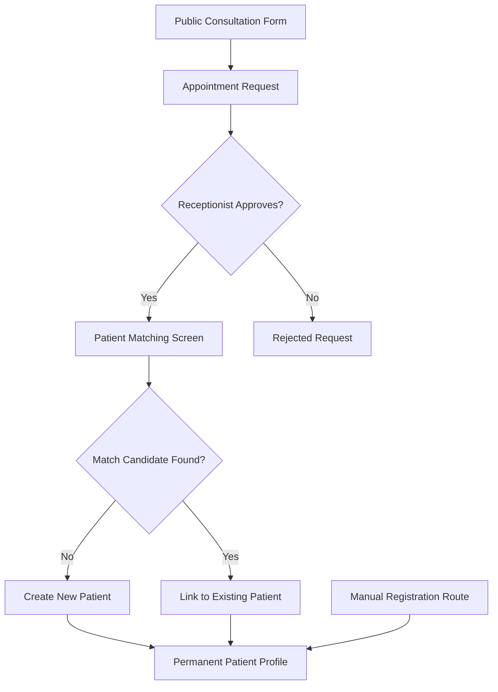

# Patient Management Workflows

This document details patient lifecycles and registration flows.

## Lifecycle States

Patients transition through the following states defined in `PatientStatus`:

1. **ACTIVE**: The patient is active but not currently undergoing a specific therapy plan.
2. **UNDER_TREATMENT**: The patient has an ongoing therapy or treatment schedule.
3. **FOLLOW_UP**: The patient completed standard treatment and is currently scheduled for periodic checks.
4. **DISCHARGED**: Treatment successfully completed. Record marked as completed.
5. **INACTIVE**: The patient is on hold or stopped visiting the clinic.

## Soft Deletion and Auditing

- **Soft Delete**: Hard deletes are prohibited on Patient profiles to protect medical history records. Calling the DELETE endpoint marks `is_deleted = True` and records `deleted_at` and `deleted_by`. Soft-deleted patient records are filtered out of list views.
- **Audit Trails**: Every creation, update, bulk modification, export, and soft deletion is captured in the global `ActivityLog` referencing the user, timestamp, IP address, and details.
